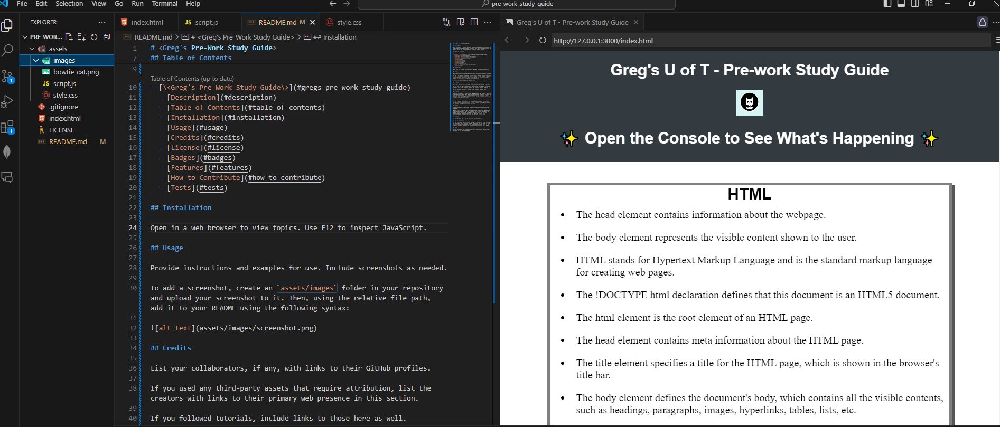

# <Greg's Pre-Work Study Guide>

## Description

This project is a website designed to showcase the basic skills used in website design and deployment. It should make learning and reviewing the topics easier and give a reference to things I have learned.

## Table of Contents

- [\<Greg's Pre-Work Study Guide\>](#gregs-pre-work-study-guide)
  - [Description](#description)
  - [Table of Contents](#table-of-contents)
  - [Installation](#installation)
  - [Usage](#usage)
  - [Credits](#credits)
  - [License](#license)

## Installation

Open in a web browser and visit [alt link](https://savevsgames.github.io/pre-work-study-guide/) to view topics. Use F12 to inspect JavaScript.

## Usage

Add elements to the lists as needed in your IDE.

## Credits

U of T Bootcamp Class - Pre-Work

## License

MIT

